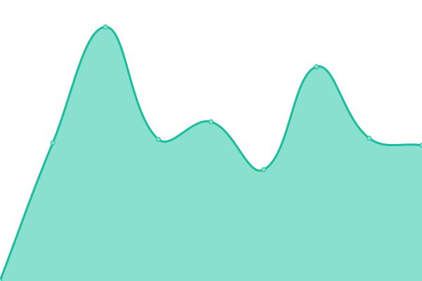

# [📈 Live Status](https://phieri.github.io/upptime): <!--live status--> **🟩 All systems operational**

This repository contains the open-source uptime monitor and status page for [Philip Eriksson](https://www.philiperiksson.se), powered by [Upptime](https://github.com/upptime/upptime).

With [Upptime](https://upptime.js.org), you can get your own unlimited and free uptime monitor and status page, powered entirely by a GitHub repository. We use [Issues](https://github.com/phieri/upptime/issues) as incident reports, [Actions](https://github.com/phieri/upptime/actions) as uptime monitors, and [Pages](https://phieri.github.io/upptime) for the status page.

<!--start: status pages-->
<!-- This summary is generated by Upptime (https://github.com/upptime/upptime) -->
<!-- Do not edit this manually, your changes will be overwritten -->
<!-- prettier-ignore -->
| URL | Status | History | Response Time | Uptime |
| --- | ------ | ------- | ------------- | ------ |
|  [SSA webbplats](https://www.ssa.se) | 🟩 Up | [ssa-webbplats.yml](https://github.com/phieri/upptime/commits/HEAD/history/ssa-webbplats.yml) | 

 2219ms
     
 | 

<a href="https://phieri.github.io/upptime/history/ssa-webbplats">100.00%</a>
    

|  [Certifikatprov](https://examen.ssa.se) | 🟩 Up | [certifikatprov.yml](https://github.com/phieri/upptime/commits/HEAD/history/certifikatprov.yml) | 

 1544ms
     
 | 

<a href="https://phieri.github.io/upptime/history/certifikatprov">100.00%</a>
    

|  [Kurswebb](https://kurs.ssa.se) | 🟩 Up | [kurswebb.yml](https://github.com/phieri/upptime/commits/HEAD/history/kurswebb.yml) | 

 1304ms
     
 | 

<a href="https://phieri.github.io/upptime/history/kurswebb">100.00%</a>
    

<!--end: status pages-->

[**Visit our status website →**](https://phieri.github.io/upptime)

## 📄 License

- Powered by: [Upptime](https://github.com/upptime/upptime)
- Code: [MIT](./LICENSE) © [Anand Chowdhary](https://anandchowdhary.com), supported by [Pabio](https://pabio.com)
- Data in the `./history` directory: [Open Database License](https://opendatacommons.org/licenses/odbl/1-0/)
