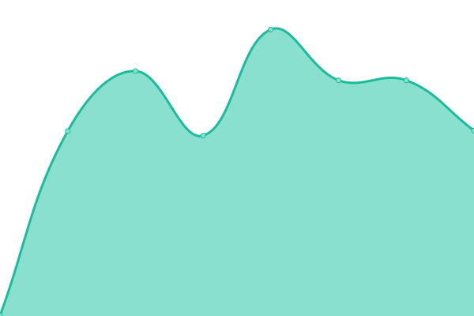

# [📈 Live Status](https://phieri.github.io/upptime): <!--live status--> **🟧 Partial outage**

This repository contains the open-source uptime monitor and status page for [Philip Eriksson](https://www.philiperiksson.se), powered by [Upptime](https://github.com/upptime/upptime).

With [Upptime](https://upptime.js.org), you can get your own unlimited and free uptime monitor and status page, powered entirely by a GitHub repository. We use [Issues](https://github.com/phieri/upptime/issues) as incident reports, [Actions](https://github.com/phieri/upptime/actions) as uptime monitors, and [Pages](https://phieri.github.io/upptime) for the status page.

<!--start: status pages-->
<!-- This summary is generated by Upptime (https://github.com/upptime/upptime) -->
<!-- Do not edit this manually, your changes will be overwritten -->
<!-- prettier-ignore -->
| URL | Status | Historik | Svarstid | Tillgänglighet |
| --- | ------ | ------- | ------------- | ------ |
|  [Webbplats](https://www.ssa.se) | Nere | [webbplats.yml](https://github.com/phieri/upptime/commits/HEAD/history/webbplats.yml) | 

 1171ms
     
 | 

<a href="https://phieri.github.io/upptime/history/webbplats">99.87%</a>
    

|  [Certifikatprov](https://examen.ssa.se) | Uppe | [certifikatprov.yml](https://github.com/phieri/upptime/commits/HEAD/history/certifikatprov.yml) | 

 1368ms
     
 | 

<a href="https://phieri.github.io/upptime/history/certifikatprov">99.88%</a>
    

|  [Utbildning](https://kurs.ssa.se) | Uppe | [utbildning.yml](https://github.com/phieri/upptime/commits/HEAD/history/utbildning.yml) | 

 1243ms
     
 | 

<a href="https://phieri.github.io/upptime/history/utbildning">99.88%</a>
    

|  [Forum](https://forum.ssa.se) | Uppe | [forum.yml](https://github.com/phieri/upptime/commits/HEAD/history/forum.yml) | 

 1242ms
     
 | 

<a href="https://phieri.github.io/upptime/history/forum">99.89%</a>
    

|  [Contest](https://contest.ssa.se) | Uppe | [contest.yml](https://github.com/phieri/upptime/commits/HEAD/history/contest.yml) | 

 759ms
     
 | 

<a href="https://phieri.github.io/upptime/history/contest">99.89%</a>
    

|  [HF Contest Cup](https://hfcup.ssa.se) | Uppe | [hf-contest-cup.yml](https://github.com/phieri/upptime/commits/HEAD/history/hf-contest-cup.yml) | 

 3451ms
     
 | 

<a href="https://phieri.github.io/upptime/history/hf-contest-cup">99.90%</a>
    

|  [SAC](https://www.sactest.net) | Uppe | [sac.yml](https://github.com/phieri/upptime/commits/HEAD/history/sac.yml) | 

 2272ms
     
 | 

<a href="https://phieri.github.io/upptime/history/sac">99.90%</a>
    

|  [Kansli](https://kansli.ssa.se) | Uppe | [kansli.yml](https://github.com/phieri/upptime/commits/HEAD/history/kansli.yml) | 

 1034ms
     
 | 

<a href="https://phieri.github.io/upptime/history/kansli">99.91%</a>
    

|  [Hamshop](https://hamshop.ssa.se) | Uppe | [hamshop.yml](https://github.com/phieri/upptime/commits/HEAD/history/hamshop.yml) | 

 1807ms
     
 | 

<a href="https://phieri.github.io/upptime/history/hamshop">99.91%</a>
    

<!--end: status pages-->

[**Visit our status website →**](https://phieri.github.io/upptime)

## 📄 License

- Powered by: [Upptime](https://github.com/upptime/upptime)
- Code: [MIT](./LICENSE) © [Anand Chowdhary](https://anandchowdhary.com), supported by [Pabio](https://pabio.com)
- Data in the `./history` directory: [Open Database License](https://opendatacommons.org/licenses/odbl/1-0/)
